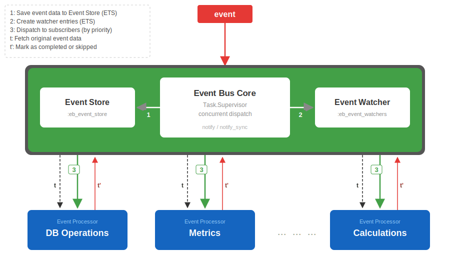

# EventBus

[](https://hex.pm/packages/event_bus)
[](https://hex.pm/packages/event_bus)
[](./LICENSE.md)

Traceable, extendable, and minimalist event bus implementation for Elixir, with an ETS-backed event store and built-in subscriber lifecycle tracking.

This repository is a maintained and modernized fork of [otobus/event_bus](https://github.com/otobus/event_bus), which is no longer actively maintained. It features an improved architecture, concurrent dispatch, subscriber priorities and guards, cancellation, and limited subscriptions.



## Contents

- [Highlights](#highlights)
- [Installation](#installation)
- [Quick start](#quick-start)
- [Usage](#usage)
- [TTL and event expiration](#ttl-and-event-expiration)
- [Debug mode](#debug-mode)
- [Storage model](#storage-model)
- [Documentation and ecosystem](#documentation-and-ecosystem)
- [License](#license)

## Highlights

- Asynchronous dispatch via `EventBus.notify/1`, backed by `Task.Supervisor`
- Synchronous dispatch via `EventBus.notify_sync/1` when you want to stay in the calling process
- Minimal contention under concurrent load
- Priority-based dispatch, guard filters, and event cancellation
- Limited subscriptions (`subscribe_once/2`, `subscribe_n/3`) with safe concurrent delivery
- Event shadow delivery (`{topic, id}`) instead of copying full event payloads to every subscriber
- In-memory event store with automatic cleanup after all subscribers complete
- Optional traceability fields such as `transaction_id`, `initialized_at`, `occurred_at`, and `ttl`

## Installation

Install this fork from GitHub:

```elixir
def deps do
  [
    {:event_bus, github: "santiment/event_bus"}
  ]
end
```

The application starts automatically as an OTP dependency.

## Quick start

Register a topic, define a subscriber, subscribe it, and publish an event:

```elixir
config :event_bus,
  topics: [:order_created]
```

```elixir
defmodule OrderSubscriber do
  use EventBus.Subscriber

  @impl true
  def process({topic, id}) do
    event = EventBus.fetch_event({topic, id})

    IO.inspect(event.data, label: "received #{topic}")

    EventBus.mark_as_completed({__MODULE__, {topic, id}})
  end
end
```

```elixir
EventBus.subscribe({OrderSubscriber, ["order_created"]})

event = %EventBus.Model.Event{
  id: "evt-1",
  topic: :order_created,
  data: %{order_id: 42, amount: 1500}
}

EventBus.notify(event)
```

For more patterns — GenServer-based processing, configured subscribers, or persistence — see the [`examples/`](examples/) directory.

## Usage

### Register topics

Configure topics up front:

```elixir
config :event_bus,
  topics: [:message_received, :another_event_occurred]
```

Or register and unregister them at runtime:

```elixir
EventBus.register_topic(:webhook_received)
> :ok

EventBus.unregister_topic(:webhook_received)
> :ok
```

Unregistering a topic also removes its related runtime state from the internal ETS tables.

### Subscribe to topics

Subscribe a module to all topics:

```elixir
EventBus.subscribe({MyEventSubscriber, [".*"]})
> :ok
```

Subscribe to a subset of topics by regex:

```elixir
EventBus.subscribe(
  {MyEventSubscriber, ["purchase_", "booking_confirmed$", "flight_passed$"]}
)
> :ok
```

Subscribe a configured subscriber:

```elixir
config = %{region: "eu"}
subscriber = {MyConfiguredSubscriber, config}

EventBus.subscribe({subscriber, ["order_.*"]})
> :ok
```

Configured subscribers receive `{config, topic, id}` in `process/1`.
Plain subscribers receive `{topic, id}`.

When you inspect subscribers via `EventBus.subscribers/0` or `EventBus.subscribers/1`, plain subscribers are returned as `{Module, nil}`.

### Subscribe with options

You can set `:priority` and `:guard` per subscriber.

Higher priority runs first:

```elixir
EventBus.subscribe({AuthValidator, ["order_.*"]}, priority: 100)
EventBus.subscribe({OrderProcessor, ["order_.*"]}, priority: 0)
EventBus.subscribe({AuditLogger, ["order_.*"]}, priority: -10)
```

Guard functions receive the full `%EventBus.Model.Event{}` and decide whether the event should be delivered to the subscriber:

```elixir
EventBus.subscribe(
  {BigOrderHandler, ["order_.*"]},
  guard: fn event -> event.data.amount > 1000 end,
  priority: 50
)
```

Guard behavior:

- A truthy result dispatches the subscriber.
- A falsy result marks the subscriber as skipped.
- A raised exception is logged and also marks the subscriber as skipped.

Re-subscribing with `EventBus.subscribe/1` clears previously configured guard and priority options for that subscriber.

### Subscribe once or N times

Subscribers can automatically unsubscribe after processing a fixed number of events:

```elixir
EventBus.subscribe_once({MySubscriber, ["order_created"]})

EventBus.subscribe_n({MySubscriber, ["order_created"]}, 5)
```

Important details:

- The counter is decremented when the subscriber reaches a terminal state via `mark_as_completed/1` or `mark_as_skipped/1`.
- Crashes consume a count because EventBus marks the subscriber as skipped.
- In-flight tracking prevents concurrent `notify/1` calls from overdelivering limited subscriptions.
- Re-subscribing creates a new subscription generation, so old async completions do not consume the limit of a fresh subscription.

### Unsubscribe

```elixir
EventBus.unsubscribe(MyEventSubscriber)
> :ok

config = %{region: "eu"}
EventBus.unsubscribe({MyConfiguredSubscriber, config})
> :ok
```

### List subscribers

```elixir
EventBus.subscribers()
> [{{MyEventSubscriber, nil}, [".*"]}, {{AnotherSubscriber, %{}}, [".*"]}]
```

```elixir
EventBus.subscribers(:hello_received)
> [{MyEventSubscriber, nil}, {AnotherSubscriber, %{}}]
```

### Event structure

`EventBus.Model.Event` is the core payload shape:

```elixir
%EventBus.Model.Event{
  id: String.t() | integer(),
  transaction_id: String.t() | integer(),
  topic: atom(),
  data: any(),
  initialized_at: integer(),
  occurred_at: integer(),
  source: String.t(),
  ttl: integer()
}
```

At minimum, provide:

- `id`
- `topic`
- `data`

Optional fields:

- `transaction_id` helps correlate related events across a workflow.
- `initialized_at` captures when event creation started.
- `occurred_at` captures when the underlying business event happened.
- `ttl` can be used by your own consumers for expiration or retention logic.

For end-to-end tracing, populate `transaction_id` for related events and use `initialized_at` / `occurred_at` consistently. `EventSource.build/2` and `EventSource.notify/2` can fill these automatically.

Example:

```elixir
alias EventBus.Model.Event

event = %Event{
  id: "123",
  transaction_id: "tx-1",
  topic: :hello_received,
  data: %{message: "Hello"}
}
```

### Notify subscribers

Dispatch asynchronously in a supervised task:

```elixir
EventBus.notify(event)
> :ok
```

Dispatch synchronously in the current process:

```elixir
EventBus.notify_sync(event)
> :ok
```

`notify_sync/1` runs subscriber dispatch in the caller. If a subscriber hands work off to another process and marks completion later, that later completion is still asynchronous.

### Fetch an event from the store

```elixir
topic = :bye_received
id = "124"

EventBus.fetch_event({topic, id})
> %EventBus.Model.Event{...}

EventBus.fetch_event_data({topic, id})
> [user_id: 1, goal: "exit"]
```

### Mark events as completed or skipped

Subscribers are responsible for reaching a terminal state.

Mark as completed:

```elixir
EventBus.mark_as_completed({MyEventSubscriber, {:bye_received, id}})
> :ok
```

For configured subscribers:

```elixir
subscriber = {MyConfiguredSubscriber, config}
EventBus.mark_as_completed({subscriber, {:bye_received, id}})
> :ok
```

Mark as skipped:

```elixir
EventBus.mark_as_skipped({MyEventSubscriber, {:bye_received, id}})
> :ok
```

### Cancel event propagation

A subscriber can stop propagation to remaining lower-priority subscribers during `process/1`.

Return `{:cancel, reason}`:

```elixir
def process({topic, id}) do
  event = EventBus.fetch_event({topic, id})

  if authorized?(event.data) do
    EventBus.mark_as_completed({__MODULE__, {topic, id}})
  else
    {:cancel, "unauthorized"}
  end
end
```

Or raise `EventBus.CancelEvent`:

```elixir
def process({_topic, _id}) do
  raise EventBus.CancelEvent, reason: "validation failed"
end
```

Cancellation behavior:

- Remaining lower-priority subscribers are marked as skipped.
- Returning `{:cancel, reason}` marks the cancelling subscriber as completed.
- Raising `EventBus.CancelEvent` marks the cancelling subscriber as skipped.
- Regular exceptions do not cancel propagation.

### Build and emit events with `EventBus.EventSource`

`EventBus.EventSource` helps create event structs with sensible defaults.

```elixir
use EventBus.EventSource

params = %{topic: :user_created}

EventSource.build(params) do
  %{email: "jd@example.com", name: "John Doe"}
end
```

With config like this:

```elixir
config :event_bus,
  topics: [],
  ttl: 30_000_000,
  time_unit: :microsecond,
  id_generator: EventBus.Util.Base62
```

`EventSource.build/2` can auto-fill values such as:

- `id`
- `transaction_id` (defaults to `id`)
- `source`
- `ttl`
- `initialized_at`
- `occurred_at`

`EventSource.notify/2` builds and dispatches in one step:

```elixir
use EventBus.EventSource

params = %{topic: :user_created, error_topic: :user_create_erred}

EventSource.notify(params) do
  %{email: "mrsjd@example.com", name: "Mrs Jane Doe"}
end
```

If the block returns `{:error, reason}`, the event is emitted under `:error_topic` when provided.

### Subscriber examples

See [`examples/`](examples/) for ready-to-use patterns:

- [`examples/simple_subscriber.ex`](examples/simple_subscriber.ex) - minimal synchronous subscriber
- [`examples/genserver_subscriber.ex`](examples/genserver_subscriber.ex) - asynchronous processing via GenServer
- [`examples/configured_subscriber.ex`](examples/configured_subscriber.ex) - configured subscribers with `{Module, config}`
- [`examples/persistent_store_subscriber.ex`](examples/persistent_store_subscriber.ex) - persisting all events to a data store

## TTL and event expiration

EventBus stores events in ETS until every subscriber reaches a terminal state (`mark_as_completed` or `mark_as_skipped`). If a subscriber never completes — due to a bug, a crashed downstream process, or a forgotten `mark_as_completed` call — the event stays in memory indefinitely.

To prevent unbounded memory growth, enable the built-in sweeper:

```elixir
config :event_bus,
  event_ttl: 300_000,      # 5 minutes, in milliseconds
  sweep_interval: 10_000   # 10 seconds (default)
```

When `event_ttl` is set, a background process periodically scans the event store and removes events older than the TTL. The age is measured from the bus-owned insertion timestamp, not from user-provided event fields.

Configuration:

- `:event_ttl` — maximum event age in milliseconds. `nil` (default) disables the sweeper entirely. Typical values: `60_000` (1 min) for real-time systems, `300_000` (5 min) for general use, `900_000` (15 min) for batch workloads.
- `:sweep_interval` — how often the sweeper runs, in milliseconds. Defaults to `10_000` (10 seconds).
- `:sweep_mode` — `:bulk_smart` (default) or `:detailed`. Controls the sweep strategy (see below).

The sweeper never touches events that are still within their TTL, and it does not interfere with normal completion — if all subscribers finish before the TTL, the event is cleaned up immediately as usual.

### Sweep modes

**`:bulk_smart`** (default) — optimized for throughput. Events are expired in batches of 100 using ETS cursors, so memory stays constant. When no limited subscriptions (`subscribe_once`/`subscribe_n`) exist, the batch is pure ETS deletes with zero GenServer calls. When limited subscriptions are present, only those subscribers incur per-subscriber lookups, and all limit decrements are batched into a single GenServer call. Emits one `[:event_bus, :sweep, :cycle]` telemetry event per sweep with per-topic counts.

**`:detailed`** — each expired event is processed individually with full subscriber accounting and its own telemetry event. Useful when you need per-event expiration visibility (e.g., routing expired events to a dead letter topic or alerting on specific event IDs). Slower under high expiration volume.

```elixir
config :event_bus,
  event_ttl: 300_000,
  sweep_mode: :detailed
```

### Telemetry

Both modes emit after each sweep cycle:

- `[:event_bus, :sweep, :cycle]` — measurements: `%{expired_count, duration}`, metadata: `%{expired_per_topic: %{topic => count}}` (bulk_smart) or `%{}` (detailed).

Detailed mode additionally emits per expired event:

- `[:event_bus, :sweep, :expired]` — measurements: `%{age: native_time}`, metadata: `%{topic, event_id, pending_subscribers}`.

### Inspecting event age

```elixir
EventBus.fetch_event_metadata({:my_topic, "evt-1"})
# => %{inserted_at: -576460751528736} (monotonic time, native units)
```

## Debug mode

Enable debug logging:

```elixir
config :event_bus, debug: true
```

Or toggle it at runtime:

```elixir
EventBus.toggle_debug(true)
EventBus.toggle_debug(false)
```

When enabled, EventBus logs lifecycle events such as:

- `notify`
- `dispatch`
- `completed`
- `skipped`
- `cleaned`
- `subscribe`
- `unsubscribe`
- `register_topic`

Subscriber durations are measured from dispatch until the subscriber reaches a terminal state, so they reflect real processing time even for async subscribers.

## Storage model

EventBus uses ETS tables shared across all topics:

| Table | Purpose |
| --- | --- |
| `:eb_event_store` | Stores event structs keyed by `{topic, id}` |
| `:eb_event_watchers` | Tracks subscriber lists and remaining count per event |
| `:eb_event_watcher_status` | Tracks per-subscriber terminal state |
| `:eb_event_subscription_generations` | Stores the subscription generation snapshot per event |
| `:eb_topics` | Stores registered topic names |
| `:eb_subscribers` | Stores subscriber-to-pattern mappings |
| `:eb_topic_subscribers` | Stores the precomputed topic-to-subscriber index |
| `:eb_subscription_opts` | Stores priority, guard, and generation per subscriber |

When every subscriber for an event reaches a terminal state, the event store entry and observation state are cleaned up automatically.

To inspect in-flight events manually:

```elixir
:ets.tab2list(:eb_event_watchers)
> [{{topic, id}, subscribers, pending_count}, ...]

:ets.lookup(:eb_event_watcher_status, {topic, id, subscriber})
> [{{topic, id, subscriber}, :pending}]
```

ETS is not durable storage. If you need persistence, subscribe a consumer to `[".*"]` and write the fetched events to your database or message archive.

## Documentation and ecosystem

### Further reading

- [Original wiki](https://github.com/otobus/event_bus/wiki) (some pages may be outdated relative to this fork)
- [Contributing](./CONTRIBUTING.md)
- [Code of Conduct](./CODE_OF_CONDUCT.md)

### Addons

Sample ecosystem projects:

| Addon | Description | Link | Docs |
| --- | --- | --- | --- |
| `event_bus_postgres` | Persists `event_bus` events to Postgres using GenStage | [GitHub](https://github.com/otobus/event_bus_postgres) | [HexDocs](https://hexdocs.pm/event_bus_postgres) |
| `event_bus_logger` | Simple log subscriber implementation | [GitHub](https://github.com/otobus/event_bus_logger) | [HexDocs](https://hexdocs.pm/event_bus_logger) |
| `event_bus_metrics` | Metrics UI and metrics API endpoints for EventBus | [Hex](https://hex.pm/packages/event_bus_metrics) | [HexDocs](https://hexdocs.pm/event_bus_metrics) |

These addons were built for the original `otobus/event_bus` and may need updates to work with this fork.

## License

EventBus is released under the [MIT License](./LICENSE.md).
